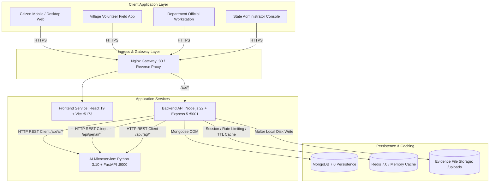
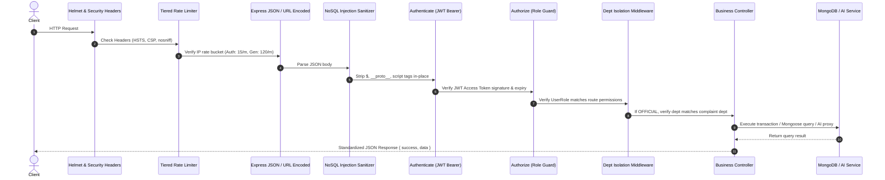
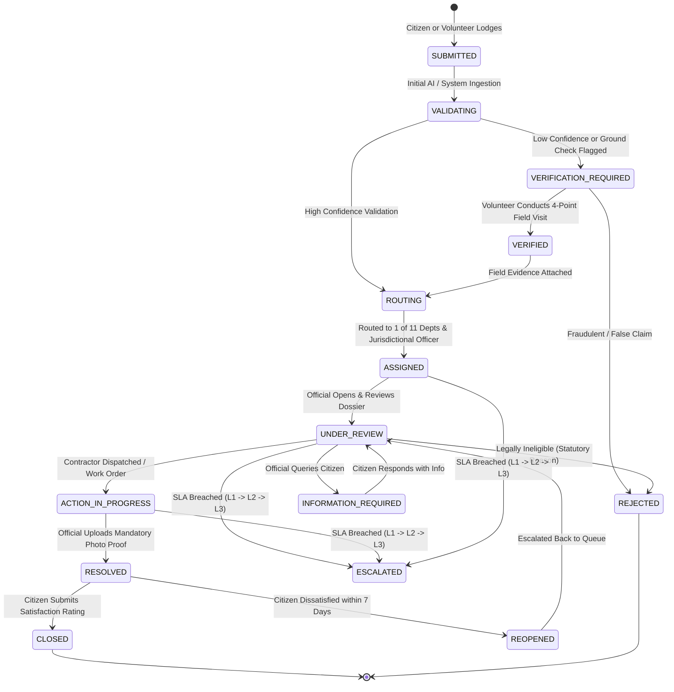
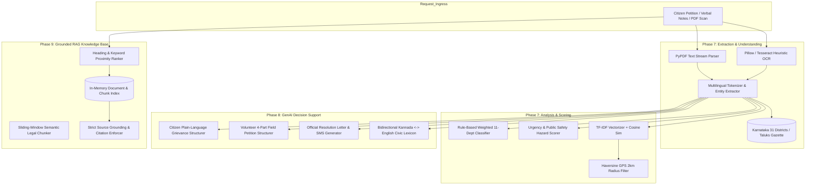
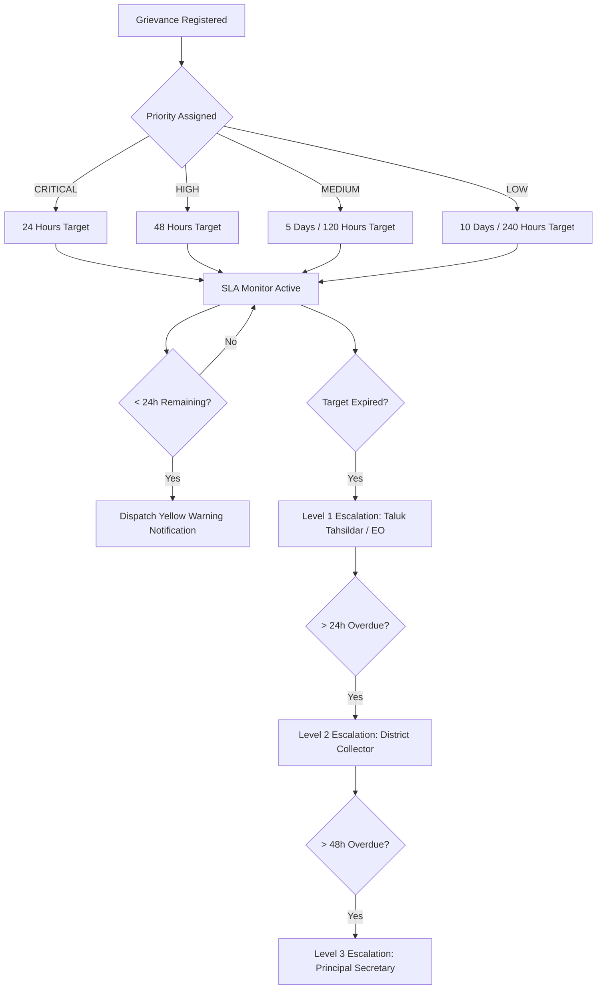
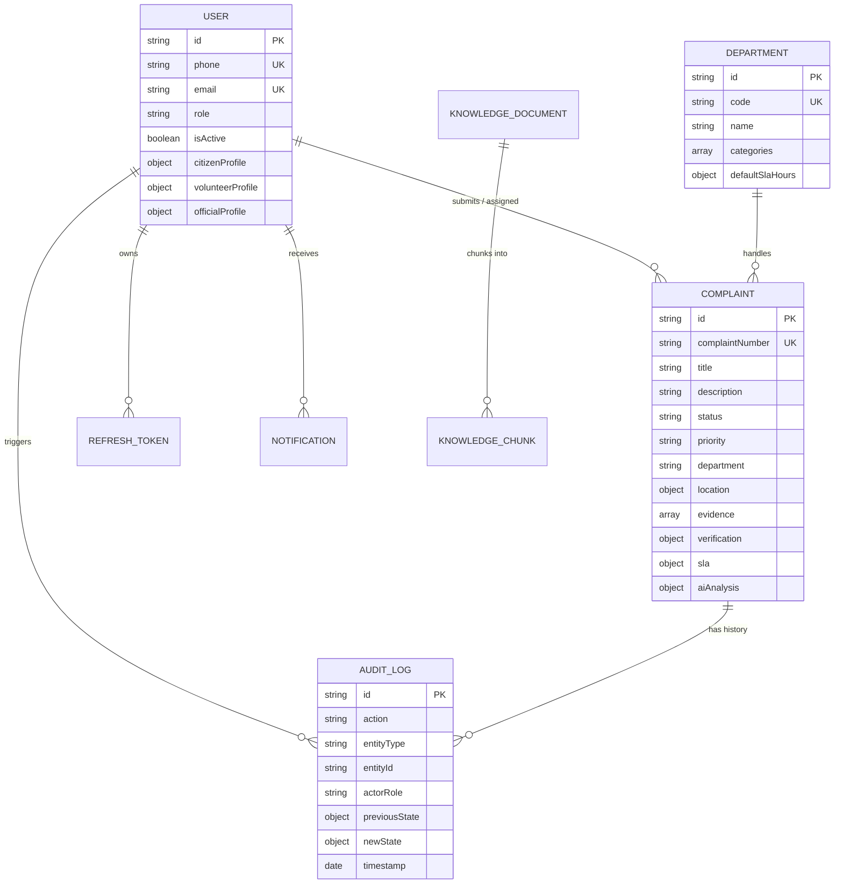
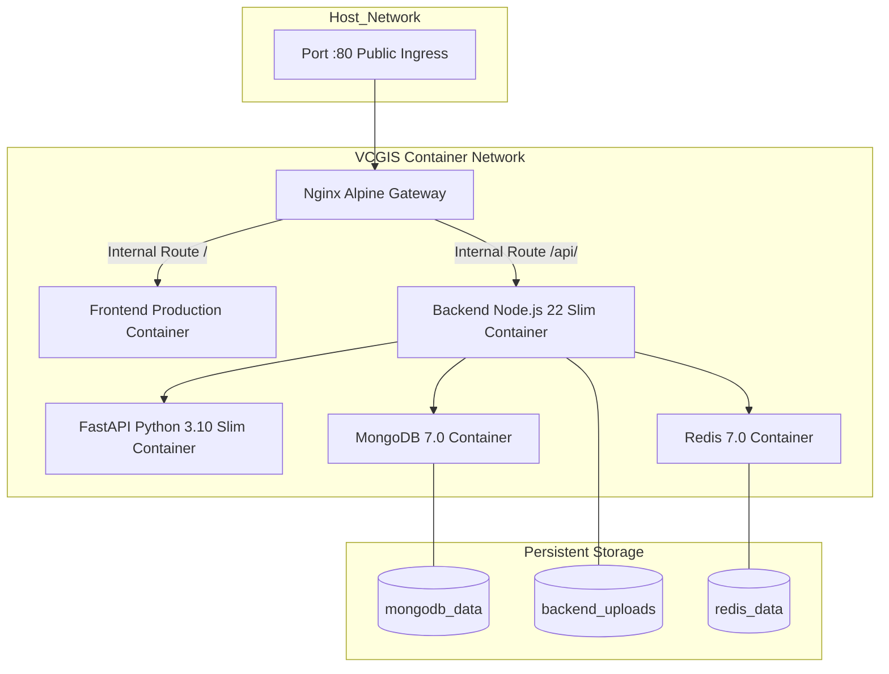

# VCGIS System Architecture Document

**System Name:** Village Volunteer-Assisted Citizen Grievance Intelligence System (VCGIS)  
**Governance Authority:** Government of Karnataka  
**Document Revision:** 1.0 (Authoritative Technical Architecture)  
**Last Updated:** September 2026  

---

## 1. Architectural Principles & System Overview

VCGIS is architected as an asynchronous, microservice-backed e-governance platform designed for high availability, fault tolerance, and strict human-in-the-loop governance. 

### Core Architectural Axioms:
1. **Human Authority Preservation:** AI and GenAI models operate strictly as advisory decision-support pipelines. No AI service is permitted to modify complaint states, reject citizen petitions, or bypass role-based authorization.
2. **Strict Departmental Isolation:** Officials can only access, view, and act on grievances assigned to their authorized department and administrative jurisdiction. Cross-department queries trigger security audit events and return HTTP 403.
3. **Decoupled Three-Tier Topology:** The web client (React/Vite), backend business engine (Node.js/Express), and AI intelligence pipeline (Python/FastAPI) communicate across standardized REST/JSON boundaries, allowing independent scaling and isolated failure domains.
4. **Zero-PII Spatial Exposure (Section 32 Compliance):** Public and analytical geographic intelligence layers suppress all citizen identity attributes (names, phone numbers, exact house addresses), exposing only aggregated spatial coordinates and department metrics.
5. **Non-Repudiable Auditability:** Every grievance status change, assignment, SLA breach, volunteer field verification, and admin configuration event is permanently recorded in an append-only audit trail.

---

## 2. Multi-Service Component Architecture

The physical deployment topology connects five interconnected services:



---

## 3. Frontend Architecture (React 19 + TypeScript + Tailwind 4)

The frontend application is constructed as a modern Single Page Application (SPA) utilizing Vite 5, React 19, and Tailwind CSS 4.

### 3.1 Modular Directory Structure
```
frontend/src/
├── components/
│   ├── admin/             # Overview, User Management, Department SLA, Jurisdictions, Audit Tabs
│   ├── ai/                # AiInsightsBadge (confidence, entities, duplicates)
│   ├── analytics/         # GisMapViewer (SVG Karnataka), Trends Chart, Dept Performance Table
│   ├── auth/              # ProtectedRoute wrapper enforcing role checks
│   ├── citizen/           # CreateGrievanceModal, GrievanceDetailModal, GrievanceCard
│   ├── complaints/        # Action history viewer, audit modal
│   ├── genai/             # CitizenAiAssistantModal, VolunteerStructuringDrawer
│   ├── layout/            # Navbar (role-specific quick links, notification bell, user badge)
│   ├── notifications/     # NotificationBell with unread counter and popover drawer
│   ├── official/          # OfficialReviewModal with live SLA timer, action drawer, resolution proof
│   ├── rag/               # KnowledgeAssistantModal (Karnataka GO and circular queries)
│   ├── sla/               # SlaComplianceCard (gauges, sweep trigger, compliance score)
│   └── volunteer/         # AssistedComplaintModal, FieldVerificationModal, CitizenRegisterModal
├── context/
│   ├── AuthContext.tsx    # State: user, accessToken, role, login, logout, refresh session
│   └── useAuth.ts         # Custom hook exposing authentication methods
├── pages/
│   ├── HomePage.tsx       # Public portal landing page with department directory & tracking
│   ├── auth/LoginPage.tsx # Dual-tab login (Citizen OTP vs Staff Email/Password)
│   ├── citizen/           # Citizen personal grievance tracking dashboard
│   ├── volunteer/         # Village volunteer cluster queue and citizen onboarding
│   ├── official/          # Department official work queue and resolution console
│   └── admin/             # Administrator console and executive analytics dashboard
└── services/api/          # Axios HTTP clients mapping 1:1 to backend route groups
```

### 3.2 Client-Side Routing & Access Control
All routes are guarded using a declarative `ProtectedRoute` component:
- `/` &rarr; `HomePage` (Public)
- `/login` &rarr; `LoginPage` (Public)
- `/citizen/*` &rarr; Guarded: `allowedRoles={[CITIZEN, ADMIN]}`
- `/volunteer/*` &rarr; Guarded: `allowedRoles={[VOLUNTEER, ADMIN]}`
- `/official/*` &rarr; Guarded: `allowedRoles={[OFFICIAL, ADMIN]}`
- `/admin/*` &rarr; Guarded: `allowedRoles={[ADMIN]}`
- `/analytics/*` &rarr; Guarded: `allowedRoles={[OFFICIAL, ADMIN]}`

---

## 4. Backend Application Architecture (Node.js 22 + Express 5)

The backend acts as the authoritative application server, managing transactions, business rules, SLA timers, and security boundaries.

### 4.1 Middleware Pipeline Execution Order
Every incoming HTTP request traverses an ordered middleware pipeline:



### 4.2 Error Handling & Standardized Response Envelope
All API controllers wrap asynchronous logic in `asyncHandler` utilities and return responses adhering to the uniform schema:
```json
{
  "success": true,
  "data": { ... },
  "message": "Operation completed successfully"
}
```
Failed requests are intercepted by `error.middleware.ts`, converting domain exceptions into structured error payloads:
```json
{
  "success": false,
  "error": {
    "code": "RATE_LIMITED",
    "message": "Too many requests. Please slow down.",
    "details": null
  }
}
```

---

## 5. Complaint Lifecycle & State Machine Architecture

The grievance lifecycle encompasses 18 distinct states managed by `complaint-lifecycle.service.ts`:



### Validated State Transition Rules:
- Transition to `RESOLVED` strictly requires `resolutionSummary` and `resolutionPhotos` (mandatory work proof).
- Transition to `REJECTED` strictly requires administrative legal grounds recorded in `rejectionReason`.
- Transition to `REOPENED` is restricted to citizens within 7 days of resolution, requiring a dissatisfaction justification.

---

## 6. AI Intelligence Microservice Architecture

The AI service operates as an autonomous FastAPI application structured into modular functional pipelines:



---

## 7. SLA & Hierarchical Escalation Architecture

In compliance with the **Karnataka Guarantee of Services to Citizens Act (Sakala Act, 2011)**, grievances are bound to statutory resolution timeframes:



---

## 8. Data Storage & Entity Relationship Architecture

Persistence is provided by MongoDB using 8 specialized collections:



---

## 9. Security & Privacy Architecture (Section 32 Compliance)

The platform implements multi-layered security controls designed to fulfill state government cybersecurity standards:

1. **Section 32 Zero-PII Spatial Guard:**
   The GIS analytics endpoint (`/api/analytics/geo`) and public dashboard map omit citizen names, mobile numbers, and street door numbers. Geographic coordinates are clustered into centroid pins with noise injection where citizen density is low.
2. **Enterprise Transport Security:**
   Strict HTTP security headers configured via Helmet:
   - `Strict-Transport-Security: max-age=31536000; includeSubDomains; preload`
   - `Content-Security-Policy`: Disallows arbitrary remote scripts, frames, and unsafe eval.
   - `X-Content-Type-Options: nosniff`
   - `X-Frame-Options: SAMEORIGIN`
   - Suppression of `X-Powered-By`.
3. **NoSQL Injection & Prototype Pollution Sanitizer:**
   `sanitize.middleware.ts` intercepts all incoming payloads, recursively stripping MongoDB operators (`$ne`, `$where`, `$gt`, etc.) and prototype mutation properties (`__proto__`, `constructor`, `prototype`).
4. **Tiered Dynamic Rate Limiting:**
   Powered by `rate-limiter-flexible` with Redis/memory backing:
   - Authentication routes (`/api/auth/*`): 15 requests per minute per IP.
   - General API routes: 120 requests per minute per IP.
   - Rate limit violations return standard HTTP 429 payloads with retry-after metadata.

---

## 10. Deployment & Orchestration Architecture

The system is packaged into isolated multi-stage production containers orchestrated via Docker Compose:



All application processes execute under non-root unprivileged users (`USER node` in backend, non-root user in AI service) and incorporate container healthcheck sweeps verifying service availability.
