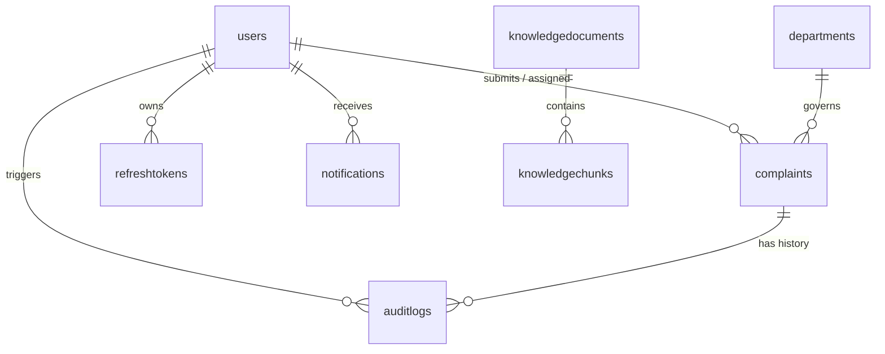

# VCGIS Database Architecture & Schema Documentation

**Database Engine:** MongoDB 7.0 (Community / Enterprise)  
**ODM Layer:** Mongoose 8.14.3  
**Database Name:** `vcgis` (Local: `mongodb://127.0.0.1:27017/vcgis`)  
**Document Revision:** 1.0  
**Audit Date:** September 2026  

---

## 1. Database Overview & Collection Inventory

The VCGIS datastore consists of **8 persistent collections** managed through strict Mongoose schemas with validation constraints, compound indexes, and automated Time-To-Live (TTL) expiration indexes:

| Collection Name | Primary Model File | Purpose & Responsibilities | Key Indexes |
|:---|:---|:---|:---|
| **`users`** | `user.model.ts` | Multi-role user accounts (Citizen, Volunteer, Official, Admin) | `phone` (sparse, unique), `email` (sparse, unique), `role` |
| **`otps`** | `otp.model.ts` | Temporary 6-digit numeric codes for citizen mobile auth | `createdAt` (TTL 300s), `phone + verified` |
| **`refreshtokens`** | `refreshToken.model.ts` | Long-lived cryptographic session tokens for JWT rotation | `expiresAt` (TTL 0s), `userId`, `token` |
| **`complaints`** | `complaint.model.ts` | Core grievance records, lifecycle states, location, SLA, AI | `complaintNumber` (unique), `department + status`, `location.coordinates` (2dsphere) |
| **`departments`** | `department.model.ts` | 11 Karnataka state departments, categories, SLA rules | `code` (unique), `name` |
| **`notifications`** | `notification.model.ts` | In-app alerts for status updates, assignments, SLA breaches | `recipient + isRead`, `createdAt` (desc) |
| **`auditlogs`** | `audit-log.model.ts` | Append-only transaction audit trail for non-repudiation | `entityType + entityId`, `actorId`, `timestamp` |
| **`knowledgedocuments`** | `knowledge-document.model.ts` | Karnataka Government Orders, circulars, and scheme chunks | `documentNumber` (unique), `department + category`, text index on content |

---

## 2. Granular Schema Specifications

### 2.1 `users` Collection (`IUser`)
Stores identities and role-specific sub-profiles across the four system roles:
- **`phone`**: `String`, unique, sparse, validated with 10-digit regex `/^\d{10}$/`.
- **`email`**: `String`, unique, sparse, lowercase, trimmed.
- **`password`**: `String`, salted bcrypt hash, `select: false` (excluded by default from queries).
- **`name`**: `String`, required, trimmed (2–100 chars).
- **`role`**: `String`, enum: `['CITIZEN', 'VOLUNTEER', 'OFFICIAL', 'ADMIN']`.
- **`isActive`**: `Boolean`, default `true`.
- **`isVerified`**: `Boolean`, default `false`.
- **`citizenProfile`**:
  - `address`, `village`, `ward`, `district`, `pincode`.
- **`volunteerProfile`**:
  - `volunteerId`: `String` (e.g., `VOL-MYS-001`).
  - `assignedVillage`: `String`.
  - `assignedWard`: `String`.
  - `assignedPanchayat`: `String`.
  - `district`: `String`.
- **`officialProfile`**:
  - `department`: `String` (must match 1 of 11 state departments).
  - `designation`: `String` (e.g., *Executive Engineer*, *Tahsildar*).
  - `jurisdictionDistrict`: `String`.
  - `jurisdictionTaluk`: `String`.
- **`adminProfile`**:
  - `superAdmin`: `Boolean`, default `false`.
  - `permissions`: `[String]`.

---

### 2.2 `complaints` Collection (`IComplaint`)
The primary transactional document recording the full lifecycle:
- **`complaintNumber`**: `String`, unique, auto-generated sequence (e.g., `CMP-2026-00042`).
- **`citizenId`**: `ObjectId`, ref: `User`, required.
- **`filedByVolunteerId`**: `ObjectId`, ref: `User`, optional (populated if volunteer-assisted).
- **`title`**: `String`, required (5–120 chars).
- **`description`**: `String`, required (10–3000 chars).
- **`department`**: `String`, required, indexed.
- **`category`**: `String`, required.
- **`subCategory`**: `String`.
- **`status`**: `String`, enum: 18 lifecycle states (default: `SUBMITTED`).
- **`priority`**: `String`, enum: `['CRITICAL', 'HIGH', 'MEDIUM', 'LOW']`, default: `MEDIUM`.
- **`location`**:
  - `village`, `ward`, `mandal`, `district`, `pincode`, `addressLine`.
  - `coordinates`: GeoJSON Point `{ type: "Point", coordinates: [longitude, latitude] }`.
- **`evidence`**: Array of file artifacts:
  - `fileName`, `fileUrl`, `fileType`, `fileSize`, `uploadedAt`.
- **`verification`**: Embedded subdocument:
  - `verifiedBy`: `ObjectId`, ref: `User`.
  - `verifiedByName`: `String`.
  - `result`: `['VERIFIED', 'REJECTED', 'REQUIRES_INFO']`.
  - `checklist`: `{ citizenIdentified: Boolean, incidentConfirmed: Boolean, evidenceValid: Boolean, severityMatches: Boolean }`.
  - `notes`: `String`.
  - `photos`: Array of evidence artifacts.
- **`assignedOfficial`**:
  - `officialId`: `ObjectId`, ref: `User`.
  - `officialName`: `String`.
  - `department`: `String`.
  - `assignedAt`: `Date`.
- **`sla`**: Embedded SLA tracking subdocument:
  - `targetResolutionDate`: `Date`, required, indexed.
  - `isBreached`: `Boolean`, default `false`, indexed.
  - `status`: `['ON_TRACK', 'AT_RISK', 'BREACHED', 'RESOLVED']`.
  - `escalationLevel`: `Number`, default `0` (0=None, 1=Tahsildar, 2=DC, 3=Principal Sec).
  - `warningSent`: `Boolean`, default `false`.
- **`resolution`**: Embedded completion proof:
  - `resolvedBy`: `ObjectId`, ref: `User`.
  - `resolvedByName`: `String`.
  - `resolvedAt`: `Date`.
  - `resolutionSummary`: `String`.
  - `resolutionPhotos`: Array of evidence artifacts (mandatory).
- **`rejection`**: Embedded statutory rejection:
  - `rejectedBy`: `ObjectId`, ref: `User`.
  - `reason`: `String`.
  - `rejectedAt`: `Date`.
- **`feedback`**: Citizen rating:
  - `rating`: `Number` (1 to 5 stars).
  - `remarks`: `String`.
  - `submittedAt`: `Date`.

---

### 2.3 `otps` Collection
Manages short-lived verification codes for citizen authentication:
- **`phone`**: `String`, required, indexed.
- **`otp`**: `String`, required (6 digits).
- **`attempts`**: `Number`, default `0` (max 3 before lockout).
- **`verified`**: `Boolean`, default `false`.
- **`createdAt`**: `Date`, default `Date.now`, **TTL index set to 300 seconds (5 minutes)**.

---

### 2.4 `refreshtokens` Collection
Cryptographic tokens for continuous session rotation:
- **`userId`**: `ObjectId`, ref: `User`, required, indexed.
- **`token`**: `String`, required, unique.
- **`expiresAt`**: `Date`, required, **TTL index set to 0 seconds on `expiresAt`**.
- **`createdByIp`**: `String`.

---

### 2.5 `auditlogs` Collection
Immutable, append-only system transaction audit trail:
- **`action`**: `String`, required (e.g. `STATUS_CHANGE`, `ASSIGNED`, `RESOLVED`, `SLA_ESCALATED`).
- **`entityType`**: `String`, enum: `['COMPLAINT', 'USER', 'DEPARTMENT', 'SYSTEM']`.
- **`entityId`**: `String`, required, indexed.
- **`actorId`**: `ObjectId`, ref: `User`, optional (system actions have null actorId).
- **`actorName`**: `String`.
- **`actorRole`**: `String`, required.
- **`previousState`**: `Mixed` (JSON snapshot).
- **`newState`**: `Mixed` (JSON snapshot).
- **`ipAddress`**: `String`.
- **`timestamp`**: `Date`, default `Date.now`, indexed.

---

### 2.6 `departments` Collection
Master registry of 11 Karnataka state departments:
- **`code`**: `String`, unique (e.g. `RWS`, `BESCOM`, `RDPR`, `HFW`, `REV`).
- **`name`**: `String`, required (e.g. *"Rural Water Supply"*).
- **`categories`**: Array of subcategories and issue tags.
- **`defaultSlaHours`**: Embedded document:
  - `CRITICAL`: `Number` (default: 24)
  - `HIGH`: `Number` (default: 48)
  - `MEDIUM`: `Number` (default: 120)
  - `LOW`: `Number` (default: 240)

---

## 3. Database Indexing Strategy & Performance Audit

### 3.1 Active Indexes Verified
1. **`complaints`**:
   - `{ complaintNumber: 1 }` &rarr; Unique, B-Tree (fast single-complaint lookup).
   - `{ department: 1, status: 1 }` &rarr; Compound (powers department isolated work queue).
   - `{ "location.coordinates": "2dsphere" }` &rarr; Geospatial index (powers GIS centroid queries and proximity duplicate detection).
   - `{ "sla.isBreached": 1, "sla.targetResolutionDate": 1 }` &rarr; Compound (powers SLA sweep cron query).
   - `{ citizenId: 1, createdAt: -1 }` &rarr; Compound (powers citizen personal dashboard).
2. **`otps`**:
   - `{ createdAt: 1 }` with `{ expireAfterSeconds: 300 }` &rarr; Background TTL automated purge.
3. **`refreshtokens`**:
   - `{ expiresAt: 1 }` with `{ expireAfterSeconds: 0 }` &rarr; Background TTL session cleanup.
4. **`auditlogs`**:
   - `{ entityType: 1, entityId: 1, timestamp: -1 }` &rarr; Powers chronological complaint audit drawer.

### 3.2 Index Optimization Opportunities (Grooming)
- **Partial Index Recommendation:** Add a partial index on `{ "sla.status": 1 }` where `{ status: { $nin: ["RESOLVED", "CLOSED", "REJECTED"] } }` to eliminate scanning completed complaints during SLA sweeps.
- **Text Search Index:** Add a compound text index on `{ title: "text", description: "text" }` in the `complaints` collection to enable full-text search across the official work queue.

---

## 4. Backup, Retention & Scalability Strategy

1. **Automated Dump & Restore:**
   - Daily automated backup execution using `mongodump --gzip --archive=/backups/vcgis-$(date +%Y%m%d).gz`.
   - Backup retention policy: Daily dumps retained for 30 days; monthly archives retained for 7 years to meet state audit compliance.
2. **Horizontal Sharding Strategy (Statewide Scale):**
   - In production with 31 Karnataka districts and 6,000+ Gram Panchayats, the `complaints` collection should be range-sharded using a compound shard key: `{ "location.district": 1, createdAt: 1 }`.
   - This ensures queries originating from specific district administrations (e.g. Belagavi, Mysuru, Kalaburagi) are routed directly to dedicated shard nodes.
