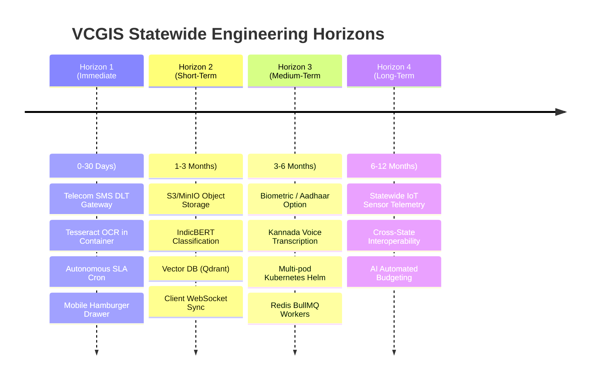

# VCGIS Future Engineering & Evolution Roadmap

**System Name:** Village Volunteer-Assisted Citizen Grievance Intelligence System (VCGIS)  
**Governance Authority:** Government of Karnataka  
**Document Revision:** 1.0 (Phased Evolution Plan)  
**Planning Horizon:** 2026 – 2027  

---

## 1. Roadmap Architecture & Horizon Phasing

The future development roadmap is organized into four distinct chronological execution horizons:

---

## 2. Horizon 1: Immediate Production Hardening (Days 0 – 30)

*Focus: Addressing operational launch blockers and physical telecom connectivity prior to district pilot launch.*

### 2.1 Telecom & Infrastructure Connectivity (Priority: P0)
- **CDAC Mobile Seva / Telecom SMS Gateway:** Replace the simulated `devOtpPreview` pipeline with live SMS dispatch over registered Karnataka DLT headers.
- **Tesseract OCR System Packaging:** Bundle `tesseract-ocr` and `tesseract-ocr-kan` binaries inside the AI microservice Dockerfile to enable native bitmap OCR on scanned petition paper.
- **Autonomous SLA Background Cron:** Implement an internal Node-cron scheduler inside `backend/src/server.ts` invoking `slaService.runEvaluationSweep()` every 60 minutes.

### 2.2 Frontend Ergonomics & Mobile Experience (Priority: P1)
- **Responsive Mobile Navigation Drawer:** Add an animated slide-out hamburger navigation menu for smartphones on viewports < 768px in `Navbar.tsx`.
- **Keyboard & Screen Reader ARIA Map Navigation:** Enrich the SVG Karnataka cartographic viewer with `aria-label`, `role="button"`, and keyboard focus handlers.

---

## 3. Horizon 2: Architecture & Model Elevation (Months 1 – 3)

*Focus: Transitioning heuristic algorithms to supervised machine learning and externalizing storage.*

### 3.1 AI / ML Elevation (Priority: P1)
- **Supervised Department Classifier:** Train a FastText or fine-tuned IndicBERT multi-class classifier on 50,000+ historical Karnataka grievances to achieve Macro-F1 &ge; 0.88.
- **Dense Multilingual Duplicate Embeddings:** Replace sparse TF-IDF with dense sentence embeddings (e.g. `paraphrase-multilingual-MiniLM-L12-v2` or Sarvam-AI embeddings) for cross-lingual semantic matching.
- **Dedicated Vector Database:** Deploy a persistent Qdrant or Milvus container to store and index tens of thousands of Karnataka Government Orders with hybrid dense/sparse search.

### 3.2 Cloud Datastore & Storage Decoupling (Priority: P1)
- **Cloud Object Storage (S3 / MinIO):** Implement an abstract `StorageService` writing file uploads to S3-compatible cloud buckets with pre-signed temporary URLs.
- **Clustered Redis Caching:** Connect distributed Redis instances for shared rate-limiting buckets and real-time cache invalidation across multi-pod deployments.

---

## 4. Horizon 3: Statewide Scale & Rural Accessibility (Months 3 – 6)

*Focus: Expanding rural access, voice input, and high-availability enterprise orchestration.*

### 4.1 Voice & Vernacular Accessibility
- **Kannada Voice-to-Text Transcription:** Integrate open-source speech recognition (e.g. OpenAI Whisper fine-tuned on Kannada or Bhashini ASR) allowing illiterate villagers to record verbal audio grievances.
- **Progressive Web App (PWA) Offline Sync:** Implement local ServiceWorker caching and IndexedDB queueing, enabling volunteers to collect field verification data completely offline in remote forest or rural hamlets.

### 4.2 Enterprise Cloud Orchestration
- **Kubernetes Helm Charts:** Develop production Helm charts configuring Horizontal Pod Autoscalers (HPA), ingress controllers, and Pod Disruption Budgets for deployment on Karnataka State Data Centre (KSDC) infrastructure.
- **Distributed Job Queue (BullMQ):** Migrate background SLA sweeps, PDF OCR processing, and SMS dispatches to persistent Redis BullMQ worker queues with retry backoff.

---

## 5. Horizon 4: Intelligent Governance & Predictive Analytics (Months 6 – 12)

*Focus: Proactive governance, automated resource allocation, and IoT sensor integration.*

### 5.1 Predictive Infrastructure Maintenance
- **Systemic Infrastructure Failure Prediction:** Train predictive models analyzing temporal grievance clusters to forecast municipal water pump failures or transformer blowouts before total blackout occurs.
- **Automated Work-Order Budget Estimation:** Integrate civil engineering schedule of rates (PWD SR Rates) to generate preliminary budget estimates alongside official resolution orders.

### 5.2 IoT Sensor & Telemetry Integration
- **SCADA & Smart Meter Ingestion:** Ingest automated telemetry from rural overhead tank level sensors and BESCOM feeder meters, automatically creating system grievances when power or water pressure cuts out.
