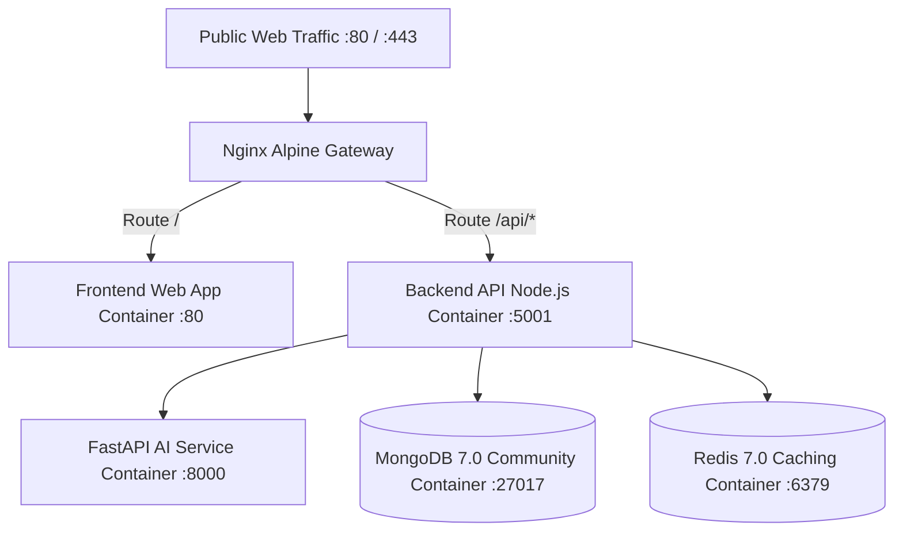

# VCGIS Production Deployment & Operations Manual

**System Name:** Village Volunteer-Assisted Citizen Grievance Intelligence System (VCGIS)  
**Governance Authority:** Government of Karnataka  
**Lead DevOps / SRE:** Senior Site Reliability Engineer  
**Document Revision:** 1.0  
**Audit Date:** September 2026  

---

## 1. Production Architecture & Container Composition

VCGIS is deployed as a multi-container Docker composition orchestrated via `docker-compose.yml`. All public web traffic enters through an Nginx Alpine reverse proxy container that terminates SSL, enforces security headers, and routes traffic internally to the respective services.



---

## 2. Environment Variables & Configuration Reference

> [!CAUTION]
> Never commit real production secrets or private keys to source control. In production environments, inject these values using secure secret managers (e.g. HashiCorp Vault, AWS Secrets Manager, or Kubernetes Secrets).

### 2.1 Backend Environment Configuration (`backend/.env`)
```bash
# Server Port & Environment
PORT=5001
NODE_ENV=production

# Database Persistence
MONGODB_URI=mongodb://mongodb:27017/vcgis

# Cryptographic Token Secrets (Must be 32+ character random strings)
JWT_SECRET=replace_with_strong_random_secret_string_in_production
REFRESH_TOKEN_SECRET=replace_with_strong_random_refresh_secret_in_production

# Caching & Distributed Session Storage
REDIS_URL=redis://redis:6379

# AI Microservice Interconnect
AI_SERVICE_URL=http://ai-service:8000

# File Upload Directory
UPLOAD_DIR=/app/uploads

# CORS Allowed Origins
CORS_ORIGIN=https://vcgis.karnataka.gov.in,http://localhost:5173
```

### 2.2 AI Service Environment Configuration (`ai-service/.env`)
```bash
# Host & Port
HOST=0.0.0.0
PORT=8000
ENVIRONMENT=production

# Worker Configuration
WORKERS=4

# Backend Gateway Ingress
CORS_ORIGINS=http://backend:5001,http://localhost:5001
```

### 2.3 Frontend Environment Configuration (`frontend/.env`)
```bash
# Backend API Base URL
VITE_API_URL=/api
```

---

## 3. Production Multi-Stage Dockerfiles

### 3.1 Backend Dockerfile (`backend/Dockerfile`)
- **Base Image:** `node:22-alpine` (Minimal attack surface).
- **Security Posture:** Non-root execution under unprivileged system user `USER node`.
- **Process Supervisor:** Utilizes `dumb-init` to handle PID 1 signal forwarding and zombie process reaping.
- **Container Healthcheck:**
  ```dockerfile
  HEALTHCHECK --interval=30s --timeout=5s --start-period=10s --retries=3 \
    CMD wget --no-verbose --tries=1 --spider http://localhost:5001/health || exit 1
  ```

### 3.2 Frontend Dockerfile (`frontend/Dockerfile`)
- **Build Stage:** Multi-stage build running `tsc -b && vite build` inside `node:22-alpine`.
- **Serving Stage:** Production static bundle served via `nginx:alpine` with Gzip compression, cache-control headers, and SPA HTML5 fallback routing configured in `nginx.conf`.

### 3.3 AI Microservice Dockerfile (`ai-service/Dockerfile`)
- **Base Image:** `python:3.10-slim`
- **Security Posture:** Non-root execution under dedicated system user `appuser`.
- **Application Server:** Runs production Uvicorn with 4 worker processes.
- **Container Healthcheck:** Verified against `GET http://localhost:8000/health`.

---

## 4. Launching the Full Stack with Docker Compose

### 4.1 Prerequisites
Ensure the host server has Docker Engine 24+ and Docker Compose v2 installed:
```bash
docker --version
docker compose version
```

### 4.2 Building & Starting Containers
```bash
# 1. Clone the production repository
cd /home/krdpk/Desktop/Projects/VCGIS-main

# 2. Verify Compose configuration syntax
docker compose config --quiet

# 3. Build and launch all 5 containers in background mode
docker compose up -d --build

# 4. Verify container runtime status
docker compose ps
```

*Expected Terminal Output:*
```text
NAME                     IMAGE                 COMMAND                  SERVICE      STATUS
vcgis-backend            vcgis-main-backend    "dumb-init node dist…"   backend      Up (healthy)
vcgis-frontend           vcgis-main-frontend   "/docker-entrypoint.…"   frontend     Up
vcgis-ai-service         vcgis-main-ai-service "uvicorn app.main:app…"  ai-service   Up (healthy)
vcgis-mongodb            mongo:7.0             "docker-entrypoint.s…"   mongodb      Up (healthy)
vcgis-redis              redis:7.0-alpine      "docker-entrypoint.s…"   redis        Up (healthy)
```

---

## 5. Database Seed & Initial Account Provisioning

On a fresh database installation, run the seed script to populate default administrative accounts, the 11 Karnataka state departments, and sample grievance records:
```bash
# Execute seeder inside the backend container
docker compose exec backend npm run seed
```

*Default Provisioned Accounts:*
- **SuperAdmin:** `admin@vcgis.gov.in` / `Admin@12345`
- **Department Official:** `official@vcgis.gov.in` / `Official@12345` (RDPR Department)
- **Village Volunteer:** `volunteer@vcgis.gov.in` / `Volunteer@12345` (Badge: `VOL-MYS-001`)
- **Citizen:** `9876543212` (Mobile OTP Authentication)

---

## 6. Backup, Restoration & Disaster Recovery Runbook

### 6.1 Daily Automated MongoDB Backup Runbook
Create a daily cron job on the host system to back up the `vcgis` database to secure storage:
```bash
#!/bin/bash
BACKUP_DIR="/var/backups/vcgis"
TIMESTAMP=$(date +"%Y%m%d_%H%M%S")
mkdir -p "$BACKUP_DIR"

# Execute mongodump directly from container
docker compose exec -T mongodb mongodump \
  --db vcgis \
  --archive \
  --gzip > "$BACKUP_DIR/vcgis_backup_$TIMESTAMP.archive.gz"

# Retain backups for 30 days
find "$BACKUP_DIR" -type f -name "*.archive.gz" -mtime +30 -delete
```

### 6.2 Database Disaster Restoration Runbook
To restore a backup archive in the event of database corruption:
```bash
# Restore archive to running MongoDB container
docker compose exec -T mongodb mongorestore \
  --nsInclude="vcgis.*" \
  --archive \
  --gzip --drop < /var/backups/vcgis/vcgis_backup_20260912_020000.archive.gz
```

---

## 7. Operational Health Monitoring & Alerts

### 7.1 Healthcheck Endpoints
- **Backend API:** `GET http://localhost:5001/health`
  - Returns: `{ "status": "ok", "service": "vcgis-backend", "uptime": 1420 }`
- **AI Microservice:** `GET http://localhost:8000/health`
  - Returns: `{ "status": "ok", "service": "vcgis-ai-service", "version": "0.1.0" }`

### 7.2 Log Streaming & Inspection
Inspect live structured logs across services:
```bash
# Follow all container logs
docker compose logs -f

# Inspect only backend API authentication logs
docker compose logs -f backend | grep "AUTH"

# Inspect AI service inference logs
docker compose logs -f ai-service
```
