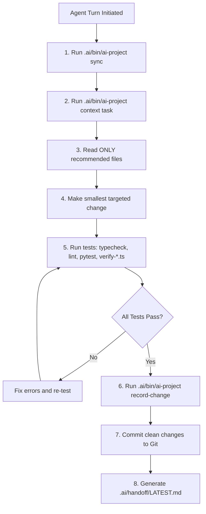

# VCGIS Multi-Agent Engineering & Coding Assistant Protocol

**System Name:** Village Volunteer-Assisted Citizen Grievance Intelligence System (VCGIS)  
**Governance Authority:** Government of Karnataka  
**Lead Author:** Senior Multi-Agent Systems Architect  
**Document Revision:** 1.0  
**Audit Date:** September 2026  

---

## 1. Prime Directive: Conversation Memory Is NOT Ground Truth

> [!IMPORTANT]
> **Cardinal Principle for all Coding Agents:**  
> **AGENT CONVERSATION MEMORY IS TRANSIENT AND CANNOT BE TRUSTED AS THE GROUND TRUTH.**  
> An agent may run out of context tokens, be restarted, or be replaced by an entirely different coding model (e.g. Antigravity &rarr; Claude Code &rarr; Cursor &rarr; Codex).  
> 
> Therefore, the VCGIS repository must remain completely understandable, verifiable, and resumable strictly from:  
> **SOURCE CODE + GIT COMMIT HISTORY + `.ai/` INTELLIGENCE + FORMAL DOCUMENTATION (`docs/`) + STATE FILES (`.ai/state/`).**

---

## 2. Multi-Agent Entry Points & Rules

The repository provides universal entry points for all major coding agents:
- **`AGENTS.md`:** Universal entry point for agentic tools (Antigravity, OpenCode, Gemini CLI).
- **`CLAUDE.md`:** Standard guidelines for Anthropic Claude Code.
- **`.github/copilot-instructions.md`:** Workspace context for GitHub Copilot.
- **`.ai/agents/instructions.md`:** In-depth execution protocols and tool rules.

---

## 3. Protocol for Incoming Agents (Step-by-Step)

Whenever an agent takes ownership of a new task, it must execute the following non-negotiable workflow:



### Step 1: Synchronize Project Intelligence
Do NOT rescan the entire repository manually. Run:
```bash
.ai/bin/ai-project sync
.ai/bin/ai-project overview
```

### Step 2: Retrieve Ranked Task Context
```bash
.ai/bin/ai-project context "<current task description>"
```
This inspects the persistent SQLite knowledge graph and outputs the exact set of relevant files, API routes, database schemas, and blast radius impacts.

### Step 3: Minimal Surgical Changes
Make the smallest appropriate change. Do not rewrite unrelated modules, delete legacy comments, or alter database schemas without updating Mongoose models and test suites simultaneously.

### Step 4: Mandatory Quality & Regression Verification
No task is complete until regression passes:
```bash
cd backend && npm run typecheck && npm run lint
cd ../frontend && npm run typecheck && npm run lint
cd ../ai-service && .venv/bin/pytest tests
cd ../backend && npx tsx src/scripts/verify-<affected-module>.ts
```

### Step 5: Record Changes & Update Intelligence
```bash
.ai/bin/ai-project sync
.ai/bin/ai-project record-change --confirm --task "<task name>"
.ai/bin/ai-project validate
```

---

## 4. Agent Handoff & Session Checkpoints

When an agent approaches its context token limit or completes its allocated turn:
1. Ensure working directory is clean (`git status`).
2. Update `.ai/handoff/LATEST.md` detailing:
   - What was accomplished.
   - What tests were run and passed.
   - What exact task is next in line.
   - Any active background daemon task IDs.
3. The next agent reads `.ai/handoff/LATEST.md` and immediately resumes execution with zero loss of momentum.
