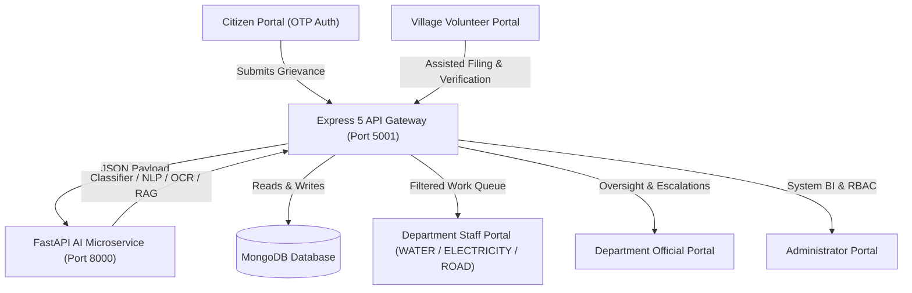

# VCGIS Architecture Specification

## Overview

The **Volunteer-Assisted Civic Grievance Intelligence System (VCGIS)** is an integrated, single-platform civic grievance resolution engine. It connects rural citizens, village volunteers, department staff, department officials, and administrators.

## Service Tier Breakdown

### 1. Frontend Web Application (`frontend/`)
- **Technology:** React 19, Vite 5, TypeScript 5, Tailwind CSS 4, Lucide Icons.
- **Port:** `http://localhost:5173`
- **Key Modules:**
  - `LoginPage.tsx`: Citizen OTP & Staff Quick-Login for Admin, Volunteer, Official, and Department Staff (💧 Water, ⚡ Electricity, 🛣️ Road).
  - `DepartmentStaffDashboard.tsx`: Department-isolated operational queue with state transitions and action logging.
  - `VolunteerDashboard.tsx`: On-behalf filing, citizen registration, and field verification.
  - `OfficialDashboard.tsx`: Department supervision, SLA countdown, resolution authorization.
  - `AdminDashboard.tsx`: User management, Sakala SLA configuration, audit log explorer.

### 2. Application Backend API (`backend/`)
- **Technology:** Node.js 22, Express 5, TypeScript 5, Mongoose 8, Zod.
- **Port:** `http://localhost:5001` (`/api/v1`)
- **Key Services:**
  - `complaint-routing.service.ts`: Routes grievances to Department Staff for operational action with Official supervision.
  - `complaint-lifecycle.service.ts`: 18-stage status state machine with strict transition guards.
  - `audit.service.ts`: Tamper-proof immutable audit logging.
  - `department-isolation.middleware.ts`: Security middleware enforcing department boundary access control.

### 3. AI Intelligence Service (`ai-service/`)
- **Technology:** Python 3.11, FastAPI, scikit-learn, joblib, PyPDF.
- **Port:** `http://localhost:8000` (`/api/ai`)
- **Key Capabilities:**
  - Department Classifier (`ROAD`, `ELECTRICITY`, `WATER`, `UNCERTAIN`, `OUT_OF_SCOPE`).
  - NLP Entity Extraction & Kannada/English Urgency token detection.
  - Duplicate Cosine & Spatial Haversine Clustering.
  - OCR Text Extraction from image/PDF evidence.
  - RAG Semantic Knowledge Assistant.

---

## Active Operational Departments

VCGIS normalizes all civic grievance categories into **exactly THREE active operational departments**:
1. `ROAD` — Roads & Transport Infrastructure
2. `ELECTRICITY` — Electricity & Power Distribution
3. `WATER` — Water Supply & Sanitation
