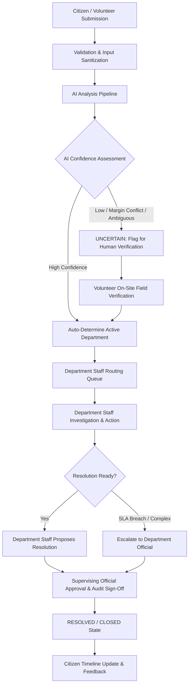

# VCGIS End-to-End Workflow Specification

## Complete Complaint Lifecycle Flow

## Actor Responsibilities

1. **Citizen:**
   - Submits complaint via OTP login.
   - Views AI analysis & tracking timeline.
   - Provides feedback (1-5 stars) upon resolution.
   - Reopens complaint if unsatisfied within policy period.

2. **Village Volunteer:**
   - Registers non-tech-literate rural villagers.
   - Files assisted complaints on behalf of citizens.
   - Performs on-site 4-point field verifications (photo + GPS tag).
   - Assists AI when classification returns `UNCERTAIN`.

3. **Department Staff (First-Class Operational Role):**
   - Belongs strictly to ONE fixed department (`WATER`, `ELECTRICITY`, `ROAD`).
   - Receives complaints routed to their department.
   - Updates status (`UNDER_REVIEW`, `ACTION_IN_PROGRESS`, `INFORMATION_REQUIRED`, `ON_HOLD`).
   - Logs field progress notes and action evidence.

4. **Department Official (Supervisory Role):**
   - Supervises departmental complaint handling.
   - Reviews SLA risk cases and higher-level escalations.
   - Approves final resolution and handles statutory rejections.

5. **Administrator:**
   - System-wide user and department configuration.
   - Monitors cross-department SLA performance and compliance.
   - Inspects immutable cross-system audit logs.
